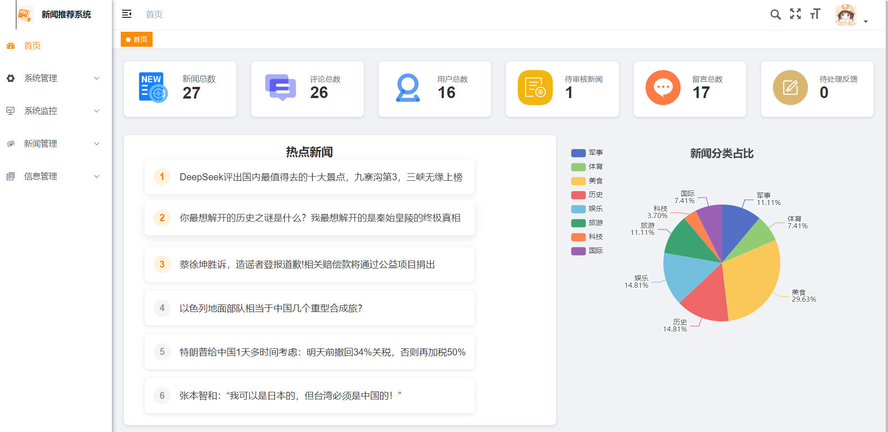
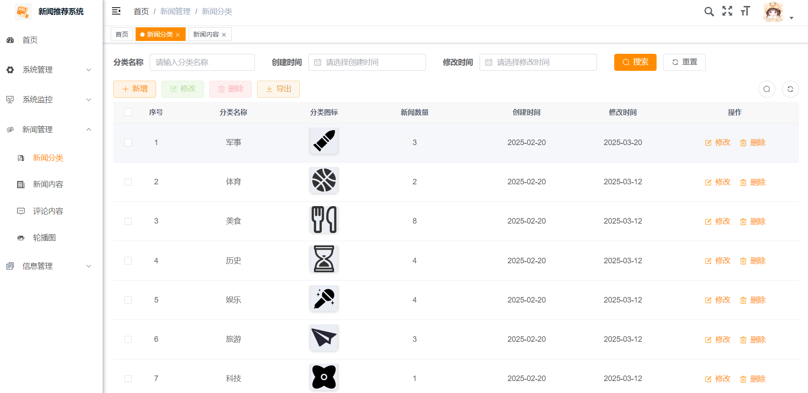
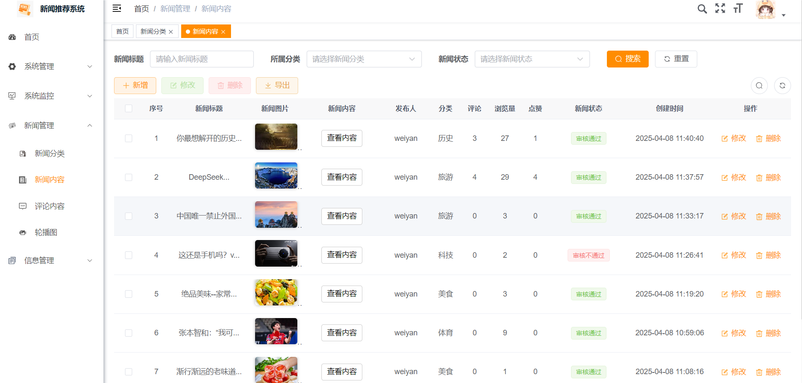
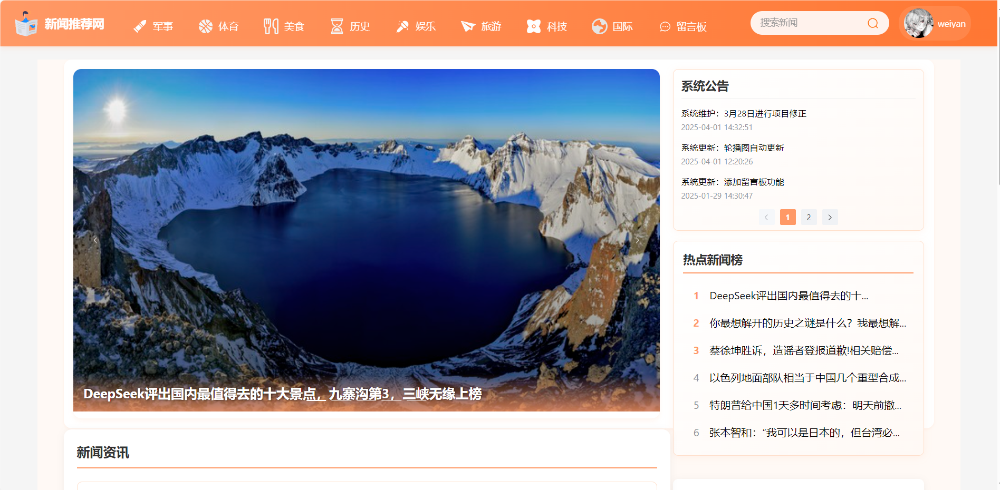
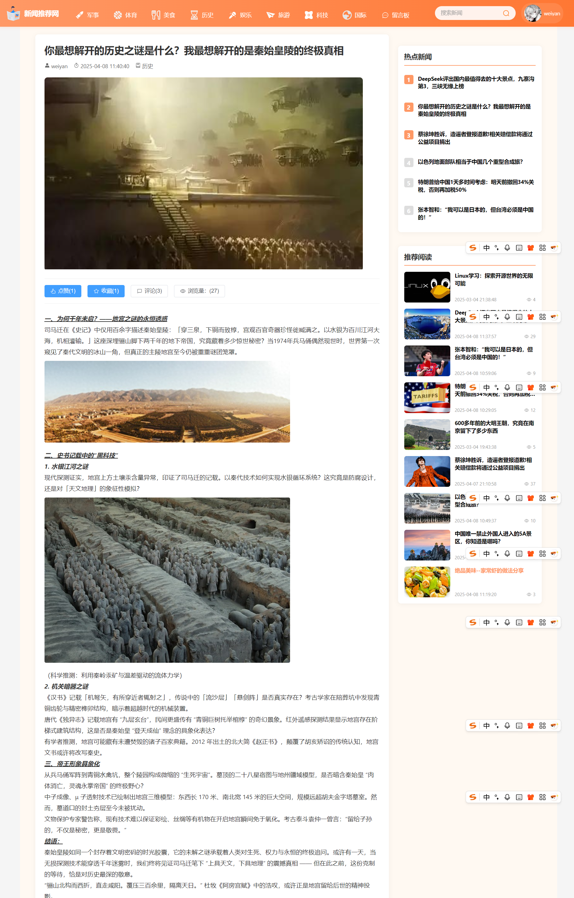
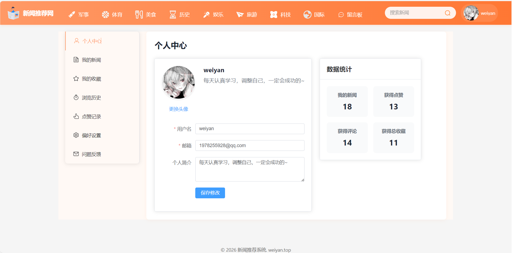

# 新闻推荐系统

## 项目介绍
本项目是基于SpringBoot3+Vue3+Element-plus的新闻推荐系统，采用前后端分离架构设计。包含三个主要部分：
- 后端服务 (newsrec)
- 管理系统前端 (newsrec-front)
- 用户前台应用 (vue)

后台管理系统基于若依开源项目进行二次开发，用户前台采用Vue3框架独立开发。

## 系统架构
- **后端**：SpringBoot 3.x + MyBatis + Redis + SpringSecurity
- **管理系统前端**：Vue 3.x + Element-plus + Axios
- **用户前台**：Vue 3.x + Element-plus + Axios

## 项目结构
```
├── newsrec                       # 后端项目
│   ├── newsrec-admin             # 启动程序【也是主模块】
│   ├── newsrec-framework         # 核心框架
│   ├── newsrec-system            # 系统模块
│   ├── newsrec-common            # 通用模块
│   ├── newsrec-generator         # 代码生成
│   ├── newsrec-quartz            # 定时任务
│   └── newsrec-manage            # 新闻管理模块
├── newsrec-front                 # 后台管理前端
└── vue                           # 用户前台
```
## 需要自己修改
- 1.本地的MYSQL连接
- 2.文件存储，改为自己的oss储存对象
- 3.导入sql文件
- 分别对应admin中的两个配置文件yml

## 项目界面展示







## 主要功能概述
- 新闻内容管理与发布
- 用户个性化推荐
- 用户互动与评论
- 系统管理与监控
- 数据分析与报表


## 环境要求
- JDK 17+[1,8也OK]
- MySQL 8.0+
- Node.js 16+
- Redis 6.0+

## 快速开始

### 后端启动
```bash
# 进入后端项目目录
cd newsrec

# 编译打包
mvn clean package

# 运行项目
java -jar newsrec-admin/target/newsrec-admin.jar
```

### 管理系统前端启动
```bash
# 进入管理系统前端目录
cd newsrec-front

# 安装依赖
npm install

# 开发环境运行
npm run dev

# 生产环境构建
npm run build:prod
```

### 用户前台启动
```bash
# 进入用户前台目录
cd vue

# 安装依赖
npm install

# 开发环境运行
npm run dev

# 生产环境构建
npm run build
```


## 访问地址
- **后台管理系统**：http://localhost:80
- **用户前台**：http://localhost:5173

## 默认账号
- **管理员账号**：admin
- **密码**：admin123

## 技术选型
- SpringBoot 3.x
- Vue 3.x
- Element-plus
- MyBatis
- Redis
- SpringSecurity
- Quartz

## 项目亮点
- 1.新闻热榜实时更新【引入了时间衰减因子与redis的定时任务】
- 2.多级评论，用户交互体验好
- 3.用户个性化推荐（用户可以自行设置喜好类型）
- 4.混合算法（精确度提高）
混合推荐（Hybrid）
● 核心思想：融合多种推荐方法的优势，提供全面、精准的个性化推荐。
● 权重分配：精心设计权重比例：内容推荐40%、协同过滤40%、热点推荐20%，实现推荐结果的最优平衡。
● 去重机制：智能过滤重复新闻，确保推荐列表的多样性和新鲜感。
● 时间衰减：引入时间衰减因子，提升新内容的曝光机会，保持推荐结果的动态性。

## 开发团队
本项目为个人毕业设计作品。

## 许可证
本系统仅用于学习和研究使用，请勿用于商业目的。

